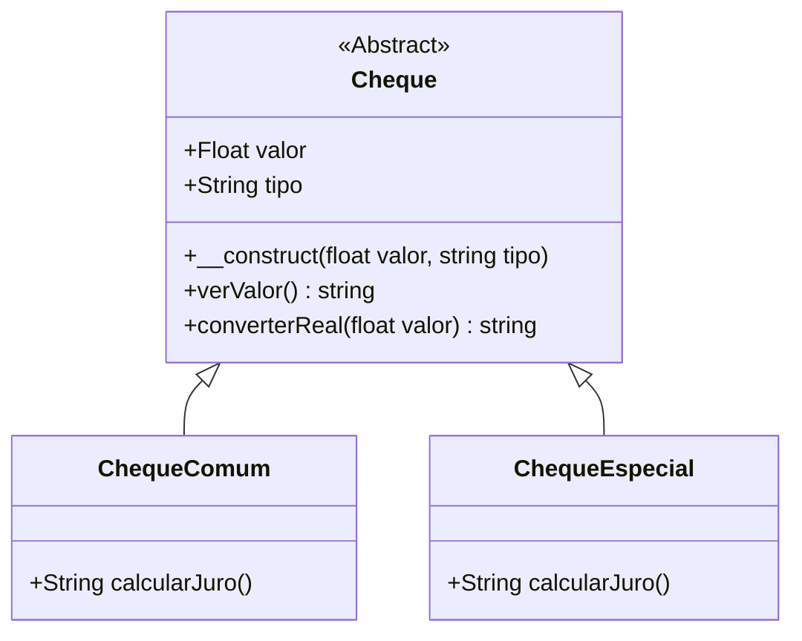

# O que é uma Classe Abstrata?

Classes Abstratas são modelos que nunca podem ser instanciadas. Necessário criar a classe filha para herda-la.

 
 

# Diagrama de Classe (UML)

```mermaid
classDiagram
    class Cheque
    <<Abstract>> Cheque
    Cheque <|-- ChequeComum
    Cheque <|-- ChequeEspecial
    Cheque : +Float valor
    Cheque : +String tipo
    Cheque: +__construct(float valor, string tipo) 
    Cheque: +verValor() string
    Cheque: +converterReal(float valor) string
    

      class ChequeComum{
          +String calcularJuro()
      }
      class ChequeEspecial{
          +String calcularJuro()
    }
```