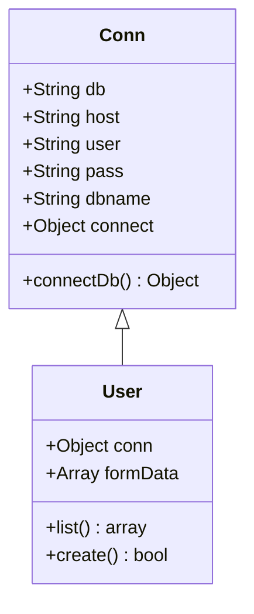

## Utilizando herança no cadastro de registro no banco de dados.
 

## Diagrama de Classe (UML)

```mermaid
classDiagram
     class Conn {
        +String db
        +String host
        +String user
        +String pass
        +String dbname
        +Object connect
        +connectDb() Object
    }
    Conn <|-- User
    class User{
        +Object conn 
        +Array formData
        +list() array
        +create() bool
    }
```