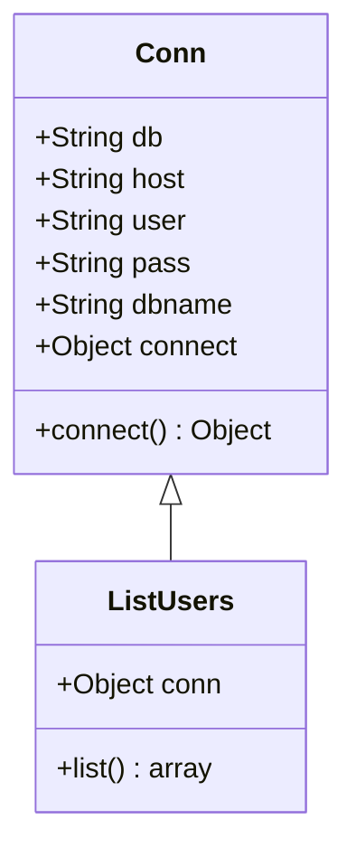

# Diagrama de Classe (UML)

```mermaid
classDiagram
     class Conn {
        +String db
        +String host
        +String user
        +String pass
        +String dbname
        +Object connect
        +connect() Object
    }
    Conn <|-- ListUsers
    class ListUsers{
        +Object conn 
        +list() array
    }
```