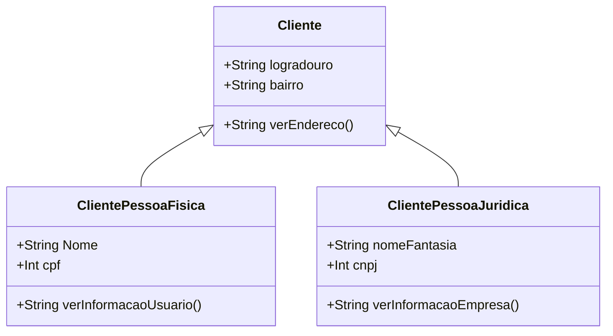

# Diagrama de Classe (UML)

```mermaid
classDiagram
      Cliente <|-- ClientePessoaFisica
      Cliente <|-- ClientePessoaJuridica
      Cliente : +String logradouro
      Cliente : +String bairro
      Cliente: +String verEndereco()
      class ClientePessoaFisica{
          +String Nome
          +Int cpf
          +String verInformacaoUsuario()
      }
      class ClientePessoaJuridica{
          +String nomeFantasia
          +Int cnpj
          +String verInformacaoEmpresa()
      }
```