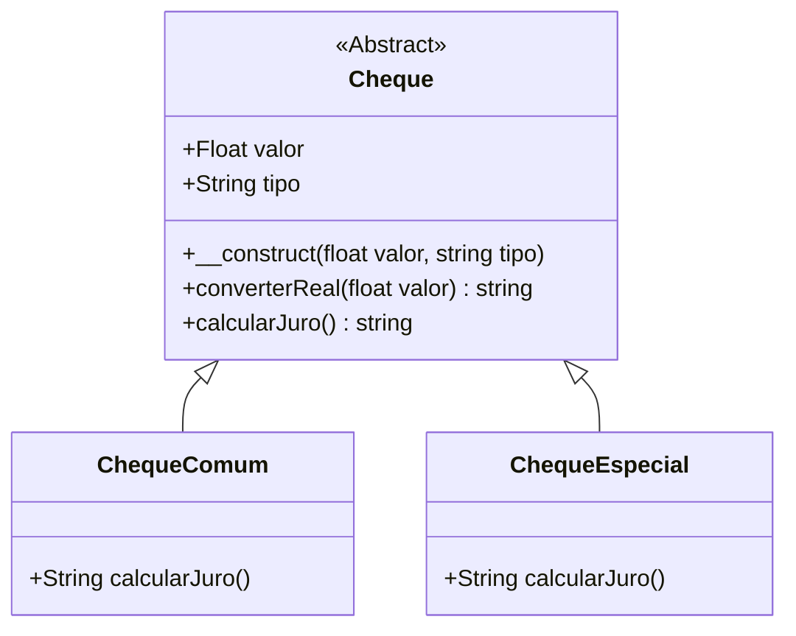

# O que é um Método Abstrato?

Métodos abstratos são os métodos que estão declarados em uma classe, mas não são definidos na classe o código desses métodos. 
Declarando um método abstrato as classes filhas são obrigadas a utilizar. 
Quando é declarado um método abstrato, obrigatoriamente a classe também deve ser declarada como abstrata. 

 
 

# Diagrama de Classe (UML)

